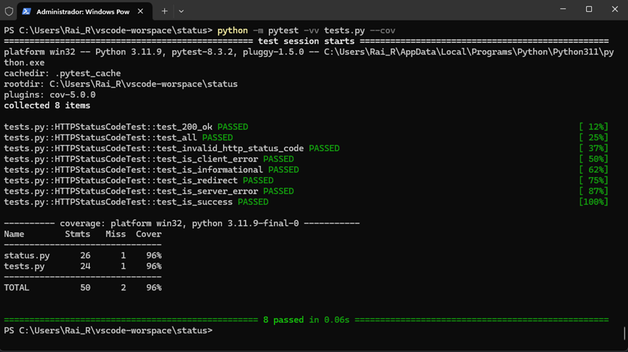
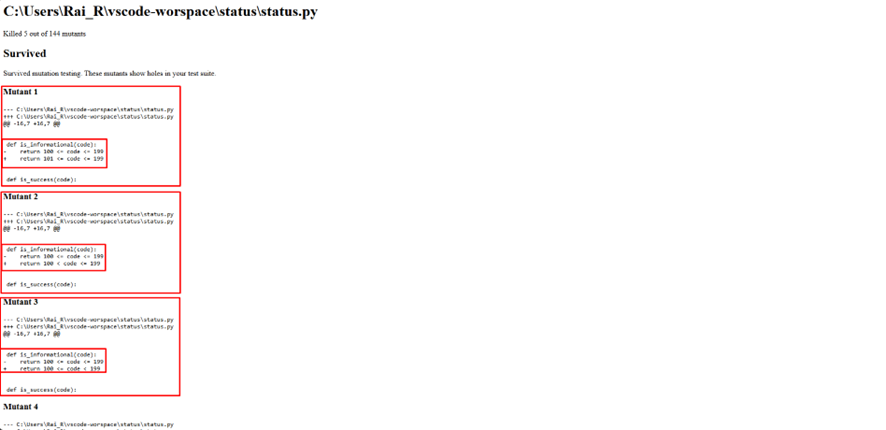
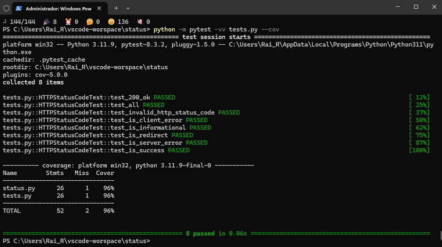
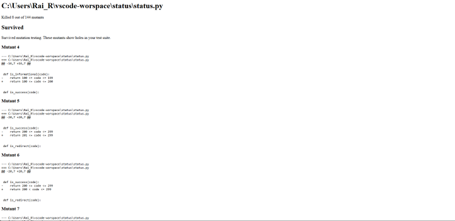

# Atividade 2 - Testes de Mutação

### Proposta da Atividade
A proposta desta atividade é realizar Testes de mutação, que têm como objetivo verificar a qualidade dos testes unitários escritos para esta aplicação.

### Configuração inicial
Para seguir com esse tutorial é necessário a instalação do Python na versão 3.

Para realização dos testes de mutação neste repositório foi utilizado como repositório base o seguinte repositório: https://github.com/avinassh/status.

Ao seguir com o tutorial, é necessária a criação de um ambiente virtual Python através do comando ``C:\caminho\para\repositorio\local\status\venv``

Após a criação do ambiente virtual, é necessário adicionar uma nova dependência dentro do arquivo ``requirements-dev.txt`` chamada ``mutmut``.

Para realizar a instalação das dependências presentes neste arquivo, basta executar o comando ``pip install -r requirements-dev.txt``.

### Execução inicial dos testes
Para verificar o teste de cobertura deste software foi utilizada a ferramenta pytest e pytest-cov. Para executar o teste de cobertura basta executar o comando ``python -m pytest -vv tests.py --cov=tests``. O resultado será apresentado conforme a imagem abaixo.

Também é possível gerar um relatório de cobertura de testes com o comando ``python -m pytest -vv tests.py --cov=tests --cov-report html``. Para acessar o resultado o relatório gerado basta acessar a pasta ``htmlcov\index.html``. O relatório possui a seguinte representação

##### Testes de Mutação
Após a geração destes relatório, seguiremos com a geração dos testes de mutação.
Para realizar os teste de mutação, basta executar o comando ``python -m mutmut run --paths-to-mutate=C:\caminho\para\repositorio\local\status\status.py``.
Durante a execução será possível visualizar a seguinte tela.

Ao finalizar a execução (que geralmente demora alguns minutos). Será disposta a tela com a seguinte informação:

Veja que dos 144 mutantes, 5 foram eliminados e 139 sobreviveram.

Também é possível gerar um relatório dos testes de mutação para melhor identificação dos mutantes sobreviventes. Para geração deste relatório basta executar o comando ``python -m mutmut html``. 

Ao executar o comando acima, o relatório é gerado no arquivo ``html\index.html``. A tela inicial deste arquivo está representada na imagem abaixo.
.

Para acessar o detalhamento dos mutantes que sobreviveram basta clicar no arquivo ``status.py``. A representação deste arquivo está na imagem abaixo.
.
Veja que nesta imagem estão destacados os mutantes 32, 33 e 34, que serão os mutante que tentaremos eliminar.

### Alteração nos casos de Teste
Para eliminação os mutantes destacados na imagem acima, foi realizada alteração no caso de teste para a função ``is_informational`` presente no arquivo ``tests.py``. A alteração realizada está representada na imagem abaixo.

### Realização de novo teste de mutação.
Após a alteração proposta acima, foi realizado um novo teste de mutação utilizando o mesmo comando apresentado acima, o comando ``python -m mutmut run --paths-to-mutate=C:\caminho\para\repositorio\local\status\status.py``. O resultado do novo teste de mutação está representado na imagem abaixo. Veja que após a alteração do teste unitário, mais 3 mutantes foram eliminados após realização do novo teste de mutação.

Foi realizado também um novo teste de cobertura para mostrar que a cobertura de testes não mudou, demonstrando a importância do uso de testes de mutação, já que apenas teste de cobertura não é suficiente para medir a qualidade do software. O resultado do novo teste de cobertura está representado na imagem abaixo.

Em seguida foi gerado um novo relatório de testes de mutação com o comando ``python -m mutmut html``. Indo novamente para o arquivo ``html\index.html`` encontramos novamente o arquivo ``status.py``. O resultado deste arquivo está representado na imagem a seguir.
.

Veja que os mutantes 32, 33 e 34 listados acima já não são mais apresentados no relatório, pois foram eliminados.

### Passos seguintes
Para continuar com a eliminação de mais mutantes vivos, basta seguir com a alteração dos casos de teste conforme demonstrado acima e então realizar a geração de novos relatórios de teste de mutação.

### Autor
Raí Rafael Santos Silva